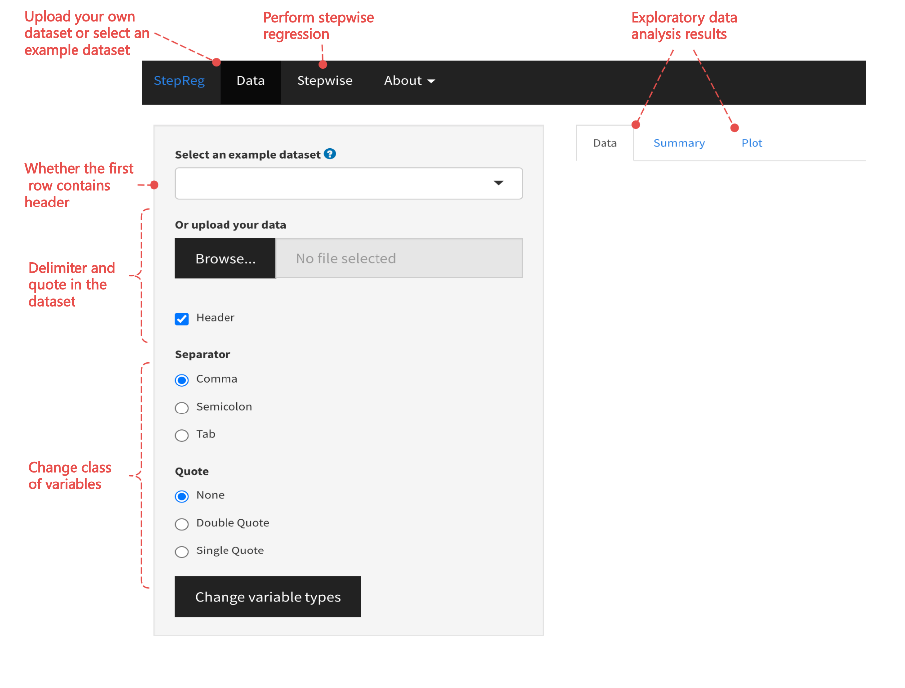
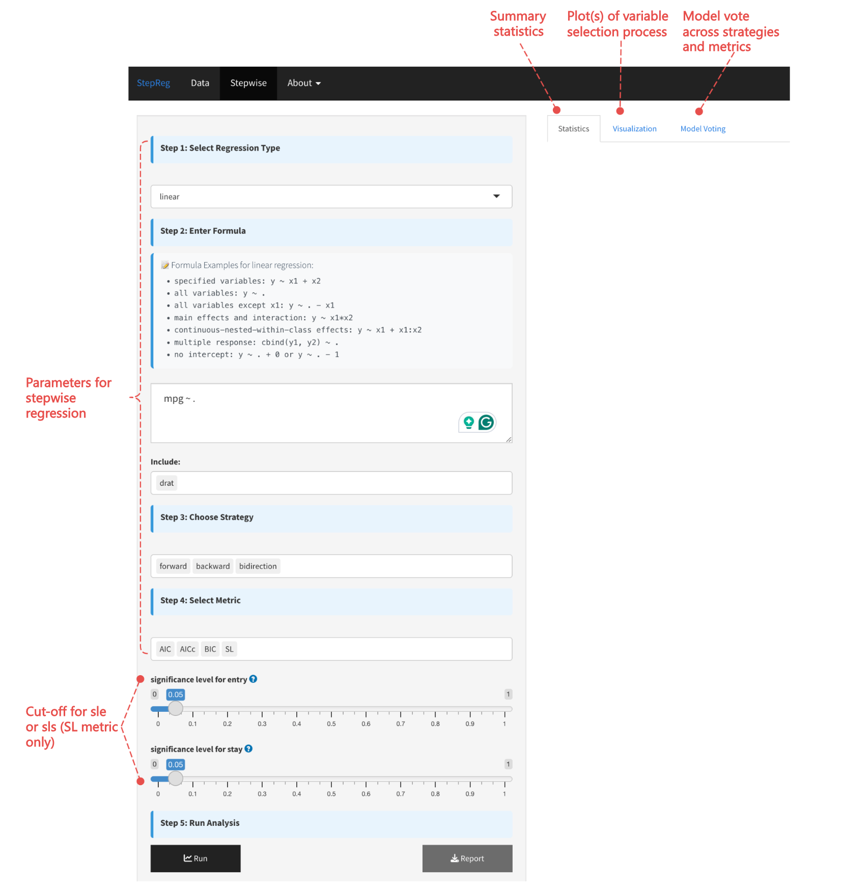

```{r include=FALSE}
knitr::opts_chunk$set(comment = NA)
```

# Interactive app {#shinyapp}

We have developed an interactive Shiny application to simplify model selection tasks for non-programmers. You can access the app through the following URL:

https://junhuili1017.shinyapps.io/StepRegShiny/

You can also access the Shiny app directly from your local machine with the following code:

```{r, eval = FALSE}
library(StepRegShiny)
StepRegGUI()
```

Here is the user interface.

{width=100%}

{width=100%}

# Session info

```{r sessionInfo, echo = FALSE}
sessionInfo()
```